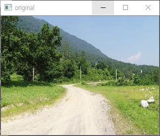
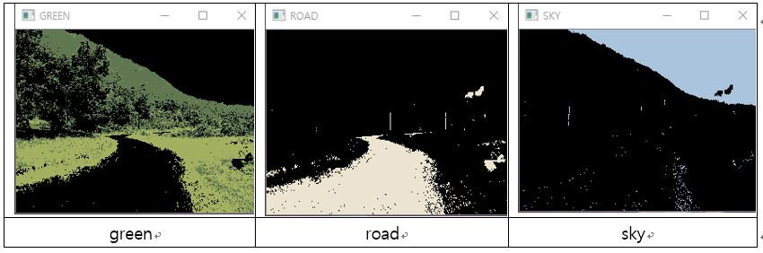
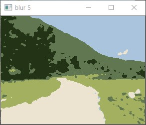
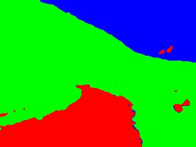

# 2019_openCV
 openCV 사용기

1. WindowsFormsApp1
    - openCVSharp
    - 기능
        1. 영상을 초당 n개의 이미지로 분할
        2. 이미지들을 FPS가 n인 영상으로 제작

        

 
2. image_processing
    - opencv-python
    - 기능
        1. 이미지들을 분할
        2. 분할된 이미지들을 새로운 색상으로 변환

    - C# form에 opencv-python을 얹으려 했으나 여러 문제로 python console로 진행..

    

    

    

    

    

    
